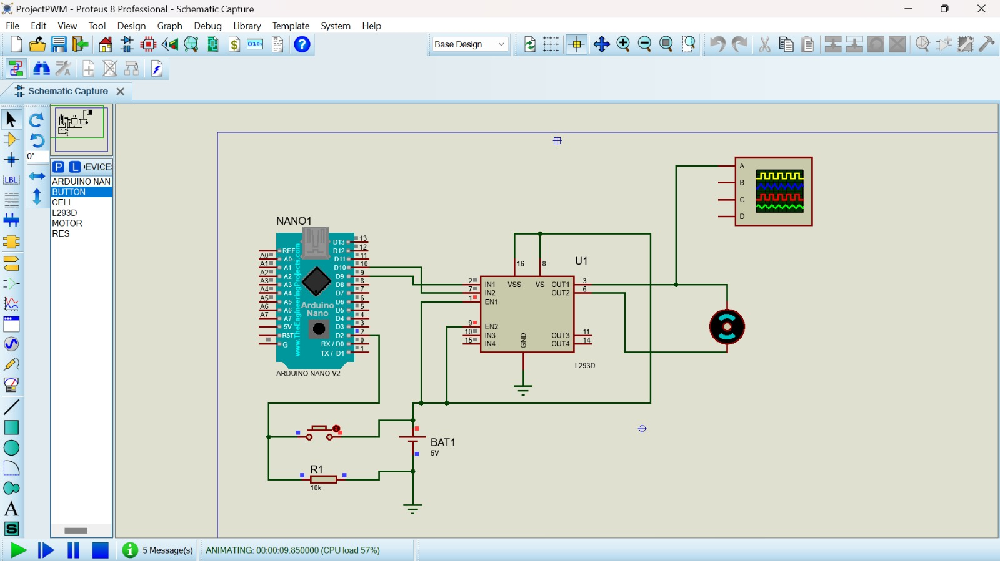
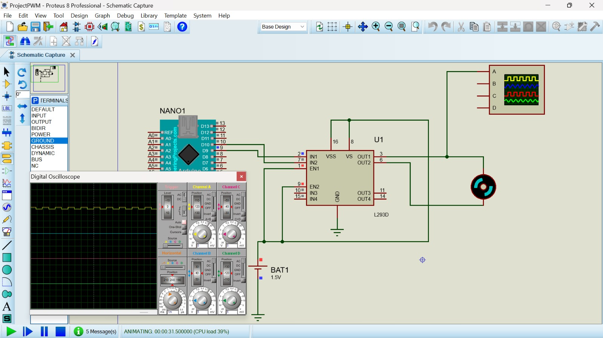

## PROJETO PWM


## Introdução ao PWM 
A Modulação por Largura de Pulso, mais conhecida pela sigla PWM (do inglês, Pulse Width Modulation), é uma técnica amplamente utilizada para controlar a potência fornecida a dispositivos eletrônicos, variando a largura dos pulsos em um sinal digital. Essa modulação é essencial em diversas aplicações, como controle de motores, ajuste de brilho de LEDs, transmissão de dados, entre outras.

Princípio de Funcionamento
O conceito básico do PWM envolve a geração de uma sequência de pulsos digitais de tensão (alta ou baixa) que alternam entre dois estados. A largura desses pulsos (o tempo durante o qual o pulso está em alta tensão) é variada, enquanto o período (o tempo total de um ciclo de pulso) é mantido constante. A razão entre o tempo em que o sinal está em alta tensão e o período total do pulso é denominada ciclo de trabalho (duty cycle).

Ciclo de Trabalho: Representa a proporção do tempo em que o sinal está em alta tensão em relação ao período total do pulso. Um ciclo de trabalho de 0% significa que o sinal está sempre em baixa tensão, enquanto um ciclo de trabalho de 100% indica que o sinal está sempre em alta tensão.

### Componentes necessários no projeto: 

```sh
Microcontrolador:
Para enviar os sinais PWM.
Motores e LEDs:
Dispositivos a serem controlados pela Placa PWM.
Fontes de Alimentação:
Para fornecer energia adequada ao sistema.
Resistores e Capacitores:
Para ajustes e filtragem de sinais.
Cabos e Conectores:

```

#### Imagens realizadas do nosso projeto no proteus: 







### Montagem:

Para a motagem do circuito foi utilizado:

```sh
Arduino
Módulo Relé
Botão Push Button
Protoboard
Fios Jumper
Conexões
```

Botão:

Conectamos uma perna do botão ao pino 4 do Arduino e a outra no botão ao GND.

Relé:

Utilizado o pino IN do módulo relé ao pino 12 do Arduino, o pino VCC do módulo relé ao pino 5V do Arduino e o pino GND do módulo relé ao GND do Arduino.

Alimentação:

Fizemos a conexão do pino 5V do Arduino à linha de alimentação positiva (+) da protoboard e o pino GND do Arduino à linha de alimentação negativa (-) da protoboard.


Feito todas as conexões no proteus fizemos a parte de codigo no vcode. Progrado toda a lógica do funcioanento passamos o codigo ao Protues e fizemos o teste de funcionamento. Se ao apertarmos o botão o relé ficar ligado, e se apertarmos o botão novamente o relé ficar desligado.

### Código Fonte 

```sh 

#include <Arduino.h>


const int motor = 9; 
const int button = 2;

int motorstate = LOW;
int buttonState = LOW;
int lastButtonState = LOW;

void setup() {
  pinMode(button, INPUT_PULLUP);
}

void loop() {

buttonState = digitalRead(button);
if(buttonState == HIGH && lastButtonState == LOW){
    motorstate++;
    if (motorstate == 0){
        analogWrite(9, 255);

    }else if (motorstate == 1){
        analogWrite(9, 191);

    }else if (motorstate == 2){
        analogWrite(9, 127);

    }else if (motorstate == 3){
        analogWrite(9, 64);

    }else if (motorstate == 4){
        analogWrite(9, 0);

    }else if (motorstate == 5){
        analogWrite(9, 255);
        motorstate = 0;
    }
}
lastButtonState = buttonState;
}
```	

### Funcionamento do projeto: 

Este código Arduino controla um relé usando um botão. A cada vez que o botão é pressionado, o estado do relé alterna entre ligado e desligado. 


Resumo do Funcionamento
Inicialização:

Configuramos o pino do relé como saída.
Configuramos o pino do botão como entrada com um resistor pull-up interno.
Loop Contínuo:

Lemos o estado do botão.
Se o botão estiver pressionado e o estado anterior também indicar que estava pressionado, alternamos o estado do relé.
Atualizamos o estado anterior do botão.
Este código proporciona um controle simples e eficaz do relé usando um botão, permitindo ligar e desligar o relé alternadamente a cada vez que o botão é pressionado
